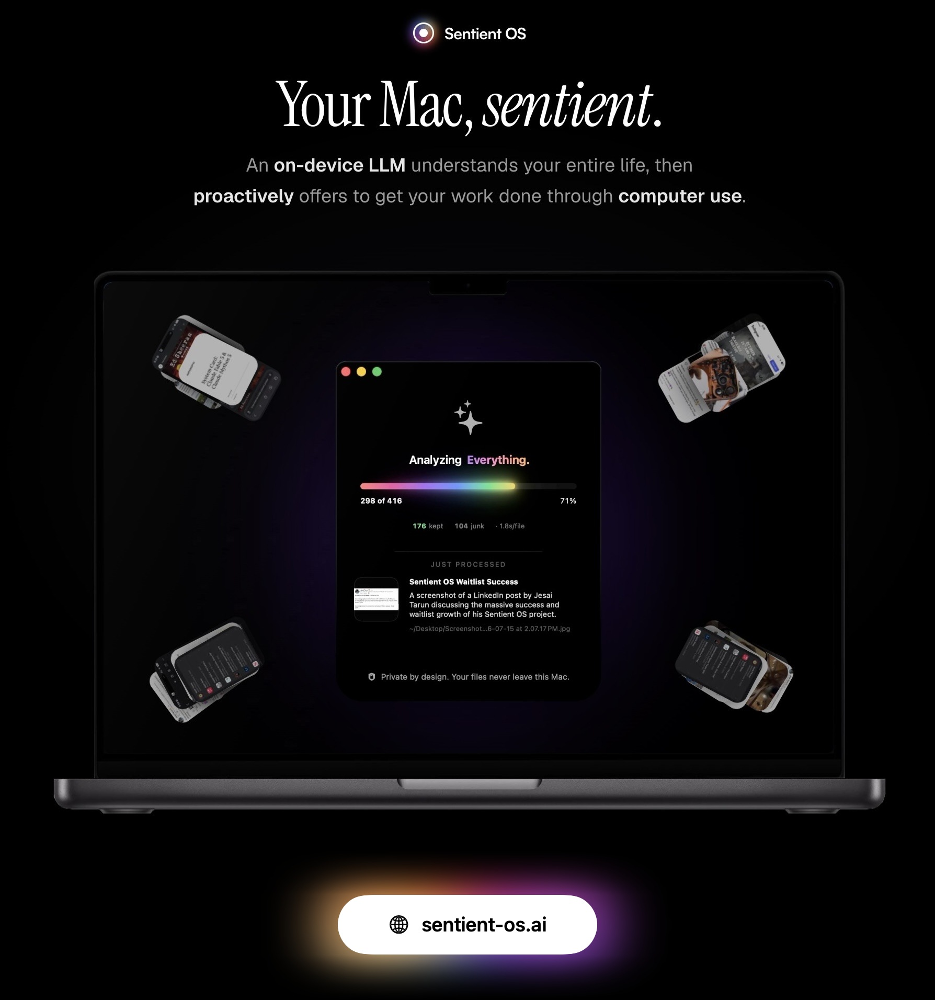

# Sentient OS — Proactive Intelligence Landing Page Clone 🚀

> An authentic, pixel-perfect clone of [sentient-os.ai](https://sentient-os.ai) built from the ground up using **React 19**, **TypeScript**, **Framer Motion**, and **Tailwind CSS v4**.

🔗 **Live Demo:** [https://sentient-clone.vercel.app/](https://sentient-clone.vercel.app/)



[](https://sentient-clone.vercel.app/)
[](https://react.dev/)
[](https://www.typescriptlang.org/)
[](https://vitejs.dev/)
[](https://tailwindcss.com/)
[](https://opensource.org/licenses/Apache-2.0)

---

## ✨ Features & Highlights

### 1. 🎬 3D MacBook Lid Physics (Cinematic Film Experience)
- **Mathematical 3D Perspective Origin:** As you scroll through the 700vh narrative timeline, dynamic matrices smoothly shift the perspective origin from `80%` (open display) to `95%` (closed clamshell).
- **Physical Hinge Rotation:** The display rotates along its bottom edge (`transformOrigin: "50% 100%"`), capturing real-world laptop curvature, aluminum bezel reflections, and shadow depth.
- **The 3:00 AM Clamshell:** Shows the machine running overnight with lid shut, accompanied by a soft chromatic perimeter glow.

### 2. 🧠 Live Neural Network ("Under the Hood")
- **Continuous Synaptic Flow:** SVG bezier connections render continuous particle impulses streaming from WhatsApp, iMessage, and Email into the on-device model and distilled Knowledge Base using CSS `offsetPath: path(...)` and custom keyframes.
- **Interactive Node System:** Hovering over (or tapping on mobile) any architecture node reveals authentic quotes, encryption badges, and mono captions.
- **Zero-Access Ciphertext Animation:** Hovering over the frontier stack triggers an instant state transition where server data illuminates with an emerald `NO READABLE USER DATA` zero-access cipher pill.

### 3. 🛒 Sidekick Autonomous Computer Use
- **Dynamic Island Menu Bar Notch:** Modeled after Apple's Dynamic Island with pulsating chromatic indicator dots.
- **Background Task Execution:** Simulates an autonomous assistant reading a saffron risotto recipe on the left and orchestrating an automated Amazon shopping cart on the right.

### 4. ⚡ Proactive Morning Cards
- Interactive task triage cards ("Reply & add meeting to cal", "Hawaii trip needs to leave chat", "Denver trip expenses").
- Real-time clickable completion states with gradient badge indicators.

### 5. 🌗 Instant Dark & White Theme Toggle
- High-contrast, accessibility-tested theme switcher with spinning rainbow conic-gradient halos.
- Deep pitch-black dark mode (`#000000`) and paper-clean light mode (`#fafafa`).

### 6. 📱 Responsive Calibration
- Zero horizontal overflows or layout clipping across Desktop (1440x900+), iPad / Tablet (768x1024), iPhone 14 (390x844), and Narrow Android screens (360x780).
- Sticky narration headings float gracefully below the 76px fixed navbar with clean top clearance.

---

## 🛠️ Tech Stack

- **Framework:** React 19 + TypeScript
- **Bundler:** Vite 8
- **Styling:** Tailwind CSS v4
- **Animations:** Framer Motion (useScroll, useTransform, useMotionTemplate)
- **Icons:** Lucide React + custom authentic SVG halos
- **Deployment:** Vercel

---

## 🚀 Getting Started

### Prerequisites
- Node.js 18+ or 20+
- npm, pnpm, or yarn

### Installation

```bash
# 1. Clone the repository
git clone https://github.com/<your-username>/sentient-os-clone.git

# 2. Navigate to project directory
cd sentient-os-clone

# 3. Install dependencies
npm install

# 4. Start the local development server
npm run dev
```

Visit `http://localhost:5173` to explore the experience locally.

### Production Build

```bash
# Build optimized static bundle for deployment
npm run build

# Preview the production build locally
npm run preview
```

---

## 📦 Deployment to Vercel

### Option 1: Drag & Drop (Vercel Drop)
Drag the `dist/` directory directly onto [vercel.com/deploy](https://vercel.com/deploy).

### Option 2: Vercel CLI
```bash
npx vercel --prod
```

---

## 📄 License

This project is licensed under the Apache-2.0 License. Designed and cloned for educational and portfolio purposes. Original product and brand belong to [Sentient-OS.ai](https://sentient-os.ai).

